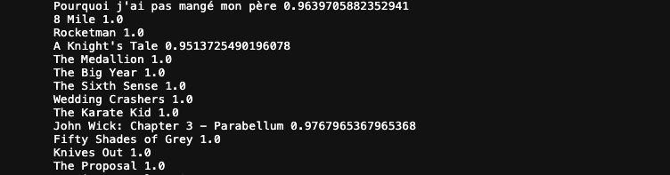

# ETL Project Report

### Team members:
- Nelson Paulo Balino
- Ezequiel Gallo
- Angela Wang

## Wikipedia Scraping
-----
#### Extract
Through research we found that Wikipedia had a concise list of books that had been adapted to feature films. From our lessons on BeautifulSoup and Splinter we believed that we could easily follow the links in the page and obtain relationships between the `isbn` number of the books and `the imdb_id` of the film.

After scraping all the data from the tables we combined all the tables using `concat` function to produce a complete dataset.

#### Transform
After inspecting the dataframe we noticed that both movies and books have multiple values in the same row, 
due to some books having multiple movie adaptations and books being in a series. By using `explode` function we were able to split the movies and books. This cleaned dataframe was then saved as a .csv file.

## Further Wikipedia Scraping
-----
#### Extract
Using the movie names listed in movies column of the csv file produced from the previous Wikipedia scrape, we were able to scrape all possible `imdb_id` in `imdb_link` by going to each of the movie's wikipedia page.

After scraping for links we noticed that some movie pages contained external wikipedia links that we would have to access in order to obtain the `imdb_id` for those movies. We developed a further scraping function which targeted these external links specifically.

A similar process was used to retrieve the `isbn` for all corresponding books within the Wikipedia list.

#### Transform
Following the retrieval of the relevant data, we split the `imdb_id` from the `imdb_links` obtained in the scrape.

For the books, we split each book from the published year using regex split so that it will only split the year and not the subtitles of each books with the delimiter "(".

Next we used `jellyfish.jaro_winkler_similarity` module to score match the book title from kaggle goodreads against this dataframe. The dataframe was then cleaned and only the rows without any nan values were stored to avoid any errors when connecting the tables.

## Movies Dataset
-----
#### Extract
A large dataset from Kaggle was used to form the base of our movie dataset as it contained a large collection of information. However to answer our initial question about whether popular books led to profitable movies, we felt that we required additinal information regarding `production_budget` and `worldwide_gross` for the movies. 

We discovered that [The Numbers](https://www.the-numbers.com/movie/budgets/all) had a large collection of the information we required. 

Initially we had hoped to use Splinter to toggled through the various pages to scrape all the information, however we soon realised that there was no distinct 'next' button. Fortunately we realised that the URLs of the subsequent pages all followed a regular pattern and so simple loop was used to scrape the succeeding pages and appended the landing page data to create a complete dataframe.

#### Transform
The data from [The Numbers](https://www.the-numbers.com/movie/budgets/all) page all came in as strings. This made it difficult to manipulate such columns such as `ProductionBudget`, `DomesticGross` and `WorldwideGross`. These columns were strip of symbols and converted to integers. The column `ReleaseDate` was also cleaned to extract the year as this would help match entries explained below. An additional column `profit_percent` was added to calculate the total revenue of each movie which would help provide insight into our initial question.

In order to join The Numbers information, we used the `jellyfish.jaro_winkler` module which took in two strings and provided a score of it's similarity with 1.0 being an exact match. A score of more than 0.9 was needed to join the entries with the year from both sets the same. Certain matches were less than 1.0 due to formatting from the various sources.

#### Load
A connection was made to the GCP SQL server and the data was simply appended to the existing table with `sqlalchemy`. This provided a more streamline workflow through Juptyer Lab. 